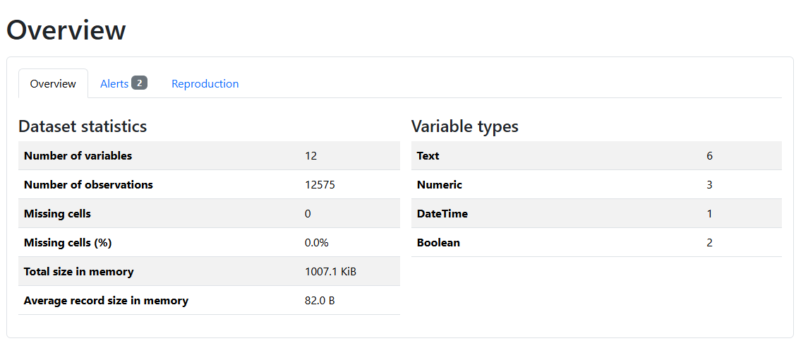

# Automated Data Cleaning + EDA Pipeline

A command-line tool that profiles, cleans and reports on any messy CSV file. Every change it makes is written to a log, so the cleaning process can be audited instead of trusted blindly.

```bash
python src/cleaner.py --input data/raw/your_file.csv --key id_column --output data/cleaned/your_file_cleaned.csv
```

One command produces three outputs: a cleaned CSV, a plain-text log of every action taken, and an HTML exploratory data analysis (EDA) report.

## Why I built this

Most cleaning scripts are tuned to a single file. They work on that file and break on the next one. I wanted a pipeline that decides what to do by looking at the **shape of the data** (unique-value counts, uniqueness ratios, date-parse success rates) rather than hardcoded column names, and that proves what it changed instead of asking to be trusted.

## What it does

| Pillar | What the pipeline does |
|---|---|
| **Completeness** | Drops 100%-null columns. Flags columns with more than 40% missing for manual review. Fills the rest by column type: median for numeric, a default for boolean-like columns, `Unknown` for text. Date columns keep their missing values, because a missing delivery date is meaningful. |
| **Uniqueness** | Drops fully duplicated rows. Flags (never drops) rows that share a key but differ elsewhere. |
| **Validity** | Detects date columns automatically and converts them to real datetimes. Flags impossible date sequences, such as a delivery recorded before the purchase. |
| **Consistency** | Strips whitespace and edge punctuation and lowercases text. Skips identifier-like columns so IDs are never altered. |

Pipeline order matters and is fixed:
`drop duplicates → flag semi-duplicates → fix dtypes → derive missing values → fill missing values → flag faulty dates → normalize text`

Fixing dtypes has to come before filling missing values. Running them in the other order corrupted the date columns during development.

## Results



**Verified against a known answer.** I took a 1,000-row clean sample of the Olist orders data, injected exactly 20 duplicate rows, and ran the pipeline.

| Planted | Pipeline result |
|---|---|
| 20 duplicate rows | `dropped 20 fully duplicated rows 1020 -> 1000` |

**Retail sales data (12,575 rows), missing values before and after:**

| Column | Before | After | How |
|---|---|---|---|
| Price Per Unit | 609 | 0 | Recovered exactly as Total Spent ÷ Quantity |
| Quantity | 604 | 0 | Median fill |
| Total Spent | 604 | 0 | Median fill |
| Item | 1,213 | 0 | Filled with `unknown` |
| Discount Applied | 4,199 | 0 | Boolean-like column, filled with `False` |

The derivation step revealed something the null percentages hid: `Quantity` and `Total Spent` are always missing in the **same 604 rows**. One equation cannot recover two unknowns, so those rows fall back to the median, and the log says so.

**Olist orders data (99,441 rows):** the 160 / 1,783 / 2,965 missing delivery dates were deliberately left unfilled, since they represent orders that never reached that stage. The pipeline flagged 1,359 rows where approval is recorded after the carrier pickup and 23 rows where carrier pickup is recorded after delivery.

Sample outputs are in [`examples/`](examples/).

## Usage

```bash
python -m venv venv
venv\Scripts\activate            # Windows
source venv/bin/activate         # Mac/Linux
pip install -r requirements.txt
```

Download the datasets (links below) into `data/raw/`, then run from the project root:

```bash
python src/cleaner.py --input data/raw/olist_orders_dataset.csv --key order_id --output data/cleaned/olist_cleaned.csv
python src/cleaner.py --input data/raw/retail_store_sales.csv --key "Transaction ID" --output data/cleaned/retail_cleaned.csv
```

| Argument | Meaning |
|---|---|
| `--input` | Path to the raw CSV |
| `--key` | Column that should uniquely identify a row (used for semi-duplicate detection) |
| `--output` | Where to save the cleaned CSV. The log is saved next to it as `*_log.txt`. |

The EDA report is saved to `reports/`.

Run the tests with `python tests/test_cleaner.py`.

## Datasets

- [Brazilian E-Commerce Public Dataset by Olist](https://www.kaggle.com/datasets/olistbr/brazilian-ecommerce) (orders table)
- [Retail Store Sales: Dirty for Data Cleaning](https://www.kaggle.com/datasets/ahmedmohamed2003/retail-store-sales-dirty-for-data-cleaning)

Raw data is not stored in this repository.

## Project structure

```
src/
  profiler.py        before/after snapshot (rows, nulls, dtypes, duplicates)
  cleaner.py         cleaning functions, orchestrator and CLI
  corrupt_data.py    builds the duplicate-injection test file
tests/
  test_cleaner.py    unit tests built on small tables with known correct answers
examples/            sample log, cleaned file and report
```

## Design decisions

- **Detection over hardcoding.** Boolean, identifier and date columns are detected by measurable properties of the data. The same code handled two datasets with different schemas.
- **Nothing is silent.** Every action, and every check that found nothing, writes a log line. A check that stays quiet cannot be told apart from a check that never ran.
- **Flag, don't delete, when judgment is needed.** Semi-duplicates and impossible dates are flagged for a human to decide.
- **Defensive date parsing.** Date detection tests a small sample first and sits inside a try/except, so one malformed column cannot crash a run.
- **Tests check values, not just "no error."** Each test uses a hand-built table where the correct output is known in advance.

## Known limitations

- The faulty-date check targets Olist's delivery-chain column names. On other datasets it logs that it was skipped.
- The Quantity / Price / Total derivation is specific to the retail schema.
- Identifier detection uses a uniqueness ratio, which can misclassify a text column on very small samples.
- Semi-duplicate detection is tested on a small hand-built table, not yet on a large corrupted file.
- Tests for the >40% missing flag, the 100%-null column drop, and the date-conversion error path are still missing.
- Derivation divides by Quantity and does not guard against zero. No zero quantities exist in the tested data.
- The EDA report runs in minimal mode for speed. `ydata-profiling` currently prints a deprecation warning.

## Tech stack

Python 3.13, pandas, numpy, ydata-profiling, argparse
